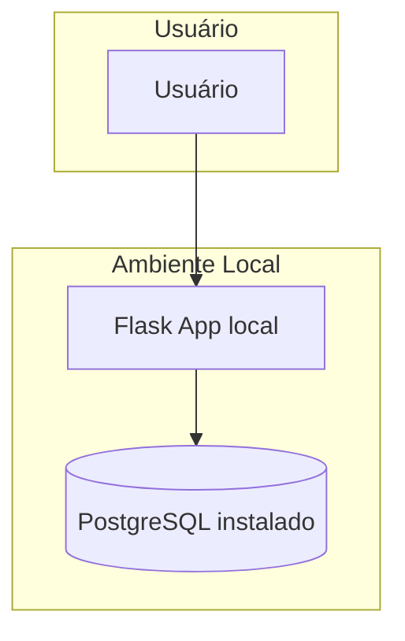
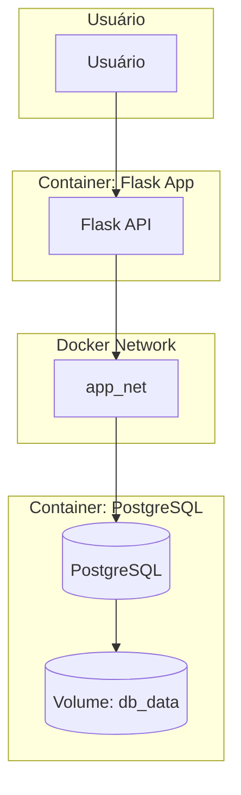

## Arquitetura Antes do Docker Compose



## Arquitetura Depois do Docker Compose



# Análise da Arquitetura:

## 1. Serviços do Projeto:

O projeto é composto por dois serviços principais:

- app → API REST desenvolvida com Flask em Python. Realiza operações CRUD.
- db   → Banco de dados PostgreSQL. Armazena os dados persistentes da aplicação.


## 2. Mapeamento das Dependências:

A relação entre os serviços é de dependência direta:
 
 O serviço app depende do serviço db para funcionar corretamente. Ele se conecta ao banco via rede Docker (host=db,         port=5432). Sem o banco, o app não consegue iniciar nem realizar operações CRUD. O serviço db não depende diretamente do   app, mas não tem utilidade isolada no contexto do projeto.


## 3. Estratégia de Conteinerização:

Cada componente foi containerizado com foco em isolamento, portabilidade e escalabilidade:

### app (API Flask):

Imagem base: python:3.11-slim

Dockerfile personalizado:

 - Instala dependências via requirements.txt;
 - Cria usuário sem privilégios (appuser);
 - Expõe a porta 8000;
 - Rede: Conectado à rede app_net para comunicação com o banco;
 - Variáveis de ambiente: Usadas para configurar a conexão com o banco;
 - Healthcheck: Verifica se o app está funcional via import do psycopg.

### db (PostgreSQL):

Imagem oficial: postgres:16

 - Volume persistente: db_data para manter os dados mesmo após reinicializações
 - Variáveis de ambiente: Definem nome do banco, usuário e senha
 - Healthcheck: garante que o banco está pronto antes do app tentar conectar


Benefícios da Arquitetura:

- Modularidade: Cada serviço pode ser atualizado ou substituído independentemente;
- Escalabilidade: Possível escalar o app ou o banco separadamente;
- Portabilidade: Pode ser executado em qualquer ambiente com Docker;
- Manutenção facilitada: Logs e erros são isolados por serviço.


# Instruções de uso

## Pré-requisitos

 - Docker;
 - Docker Compose (já integrado em versões recentes do Docker).

## Estrutura do Projeto

```text
projeto-crud/
├── docker-compose.yml
└── app/
    ├── Dockerfile
    ├── main.py
    └── requirements.txt
```

## Como rodar o projeto

1. Clone o repositório na máquina:

    git clone https://github.com/CaiocrNyimi/projeto-crud.git

2. Abra o terminal na raiz do projeto

3. Execute o comando para subir os containers:

    docker compose up --build

4. Acesse a API com o IP público da VM: http://<IP-da-VM>:8000

(Certifique-se de que a porta 8000 está liberada na máquina virtual)

# Comandos Essenciais do Docker Compose

1. Subir os containers com build:

    docker compose up --build

2. Derrubar os containers e remover volumes:

    docker compose down -v

3. Reiniciar apenas o app:

    docker compose restart app

4. Conferir logs em tempo real:

    docker compose logs -f

5. Acessar terminal do container:

    docker exec -it crud_app bash

6. Rebuid completo com limpeza:

    docker compose down -v
    docker compose up --build

# Processo de Deploy

## 1. Preparar a máquina na nuvem

- Instale o Docker e Docker Compose na máquina remota.
- Certifique se a porta 8000 está liberada no firewall e configurações da máquina virtual.

## 2. Transferir os arquivos do projeto

    git clone https://github.com/CaiocrNyimi/projeto-crud.git

- A estrutura vai ficar assim:

projeto-crud/
├── docker-compose.yml
└── app/
    ├── Dockerfile
    ├── main.py
    └── requirements.txt

## 3. Acessar a máquina via SSH

    ssh admlnx@ip-da-maquina

## 4. Navegue até a pasta do projeto

    cd projeto-crud

## 5. Subir os containers com build

    docker compose up --build

O comando vai:

- Construir a imagem da API Flask;
- Baixar a imagem do Postgre;
- Criar os containers e a rede interna;
- Inicializar o banco e rodar a API.

## 6. Testar a API remotamente

Com Insomnia/Postman, acesse:

http://<IP-da-maquina>:8000/usuarios


## 7. Manter o serviço rodando em segundo plano (opcional)

    docker compose up --build -d

(Executa os containers em modo "detached", permitindo fechar o terminal sem parar o serviço)

# Troubleshooting Básico

1. API não responde externamente:

    A porta 8000 pode estar bloqueada na nuvem ou no firewall da máquina. Certifique-se de liberar essa porta nas configurações de rede ou segurança.

2. Erro: connection to server at "db" failed:

    O banco de dados ainda está iniciando ou o nome do host está incorreto. O app já tenta reconectar automaticamente, mas verifique se o serviço db está saudável e se o host está definido como db.

3. Erro: psycopg2.OperationalError:
    
    O banco ainda não está pronto ou as credenciais estão incorretas. Verifique as variáveis de ambiente no docker-compose.yml e aguarde o healthcheck do banco completar.

4. Dados não persistem após reinício:

    O volume do banco pode ter sido removido. Certifique-se de que o volume db_data está definido no docker-compose.yml e não foi apagado com docker compose down -v.

5. App trava na conexão com o banco:

    O banco pode demorar mais que o tempo de espera padrão para iniciar. O app já possui um loop de reconexão, mas você pode aumentar o tempo de espera no main.py se necessário.

# Testando o CRUD Completo

## Criar usuário (POST /usuarios)

- Método: POST;
- URL: http://<IP-da-máquina>:8000/usuarios;

- Body (JSON):
{
  "nome": "Caio",
  "idade": 20,
  "email": "caio@email.com"
}

- Resposta esperada:
{
  "mensagem": "Usuário criado com sucesso!"
}


## Listar usuários (GET /usuarios)

- Método: GET;
- URL: http://<IP-da-máquina>:8000/usuarios;

- Resposta esperada:
{
  "nome": "Caio",
  "idade": 20,
  "email": "caio@email.com"
}


## Atualizar usuário (PUT /usuarios/1)

- Método: PUT;
- URL: http://<IP-da-máquina>:8000/usuarios/1;

- Resposta esperada:
{
  "nome": "Caio Atualizado",
  "idade": 26,
  "email": "caio.novo@email.com"
}


## Deletar usuário (DELETE /usuarios/1)

- Método: DELETE;
- URL: http://<IP-da-máquina>:8000/usuarios/1;

- Resposta esperada:
{
  "mensagem": "Usuário deletado com sucesso!"
}


# Vizualizar Banco de Dados no terminal da VM

- Acessar o banco:

    docker exec -it postgres_db psql -U user -d usuarios

- Visualizar tabela:

    SELECT * FROM usuarios;
